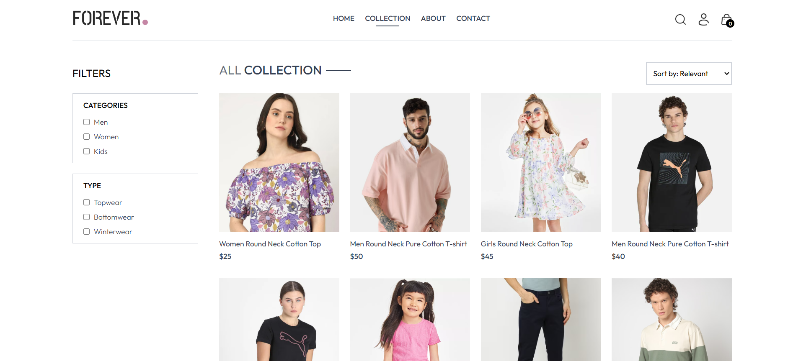
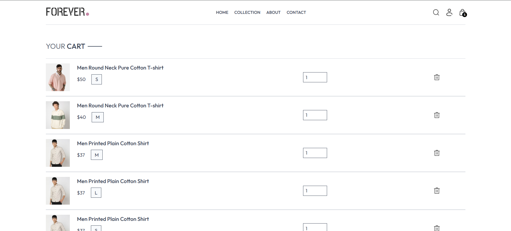
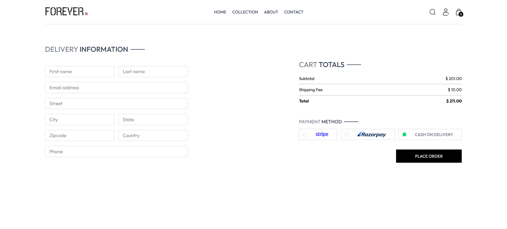
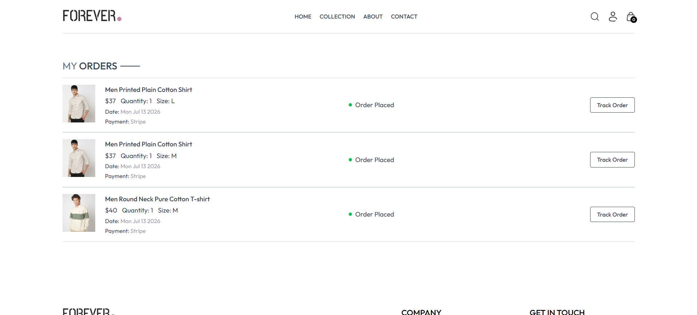
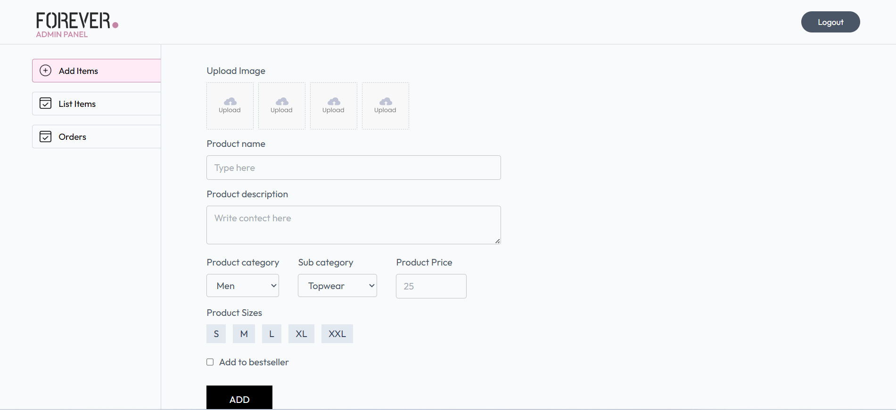
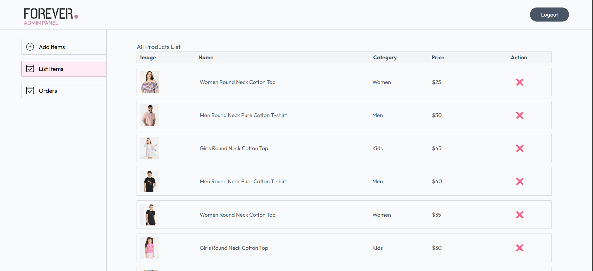
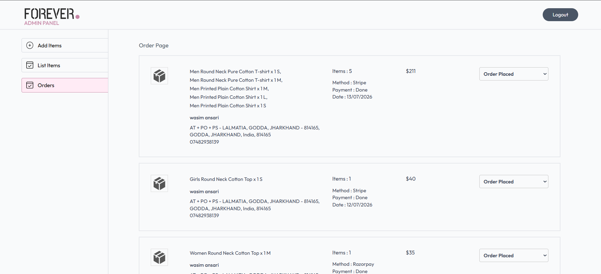

# 🛒 Forever - Full Stack MERN E-Commerce Website

A modern Full Stack MERN E-Commerce application built using **MongoDB, Express.js, React.js, and Node.js** with a dedicated **Admin Dashboard** for product management and order handling.

## 🚀 Live Demo

### Customer Website
👉 https://forever-frontend-bice-three.vercel.app/

### Admin Dashboard
👉 https://forever-admin-ten-pi.vercel.app/

### Backend API
👉 https://forever-backend-virid-ten.vercel.app/

---

# ✨ Features

## 👤 Customer Features

- User Authentication (JWT)
- Register & Login
- Browse Products
- Product Search
- Search & Filter Products
- Category Filtering
- Add to Cart
- Update Cart Quantity
- Remove from Cart
- Place Orders
- Cash on Delivery
- Razorpay Payment Integration
- Order History
- Responsive Design
- Toast Notifications

---

## 🛠️ Admin Features

- Secure Admin Login
- Add Products
- Upload Product Images
- Delete Products
- View All Products
- Manage Customer Orders
- Update Order Status
- Dashboard Interface

---

# ⚙️ Tech Stack

## Frontend

- React.js
- React Router DOM
- Context API
- Axios
- Tailwind CSS
- React Toastify

## Backend

- Node.js
- Express.js
- MongoDB
- Mongoose
- JWT Authentication
- bcrypt
- Multer
- Cloudinary
- Razorpay

## Database

- MongoDB Atlas

## Deployment

- Frontend → Vercel
- Admin Panel → Vercel
- Backend → Vercel
- MongoDB → Atlas

---

# 📁 Project Structure

```
Forever-Ecommerce
│
├── frontend
│   ├── src
│   ├── public
│   └── package.json
│
├── admin
│   ├── src
│   ├── public
│   └── package.json
│
├── backend
│   ├── controllers
│   ├── middleware
│   ├── models
│   ├── routes
│   ├── config
│   └── server.js
│
└── README.md
```

---

# 🔐 Authentication

- JWT Authentication
- Protected Routes
- Admin Authorization
- Password Hashing using bcrypt

---

# 💳 Payment Gateway
- Stripe Integration
- Razorpay Integration
- Cash on Delivery

---

# ☁️ Image Storage

Product images are uploaded using:

- Cloudinary

---

# 📦 API Modules

## User

- Register
- Login
- Authentication

## Product

- Add Product
- Remove Product
- Product List
- Single Product

## Cart

- Add to Cart
- Update Cart
- Get Cart

## Order

- Place Order
- User Orders
- All Orders
- Update Order Status

---

# 📸 Screenshots

## Home Page


---

## Product Page



---

## Cart



---

## Checkout



---

## Orders



---

## Admin Dashboard



---

## Product List



---

## Order Management



---

# 🧑‍💻 Installation

Clone the repository

```bash
git clone https://github.com/yourusername/forever-e-commerce.git
```

Move into project

```bash
cd forever-e-commerce
```

---

## Backend

```bash
cd backend
npm install
npm run server
```

---

## Frontend

```bash
cd frontend
npm install
npm run dev
```

---

## Admin

```bash
cd admin
npm install
npm run dev
```

---

# 🔑 Environment Variables

## Backend

```
PORT=

MONGODB_URI=

JWT_SECRET=

CLOUDINARY_CLOUD_NAME=

CLOUDINARY_API_KEY=

CLOUDINARY_SECRET_KEY=

RAZORPAY_KEY_ID=

RAZORPAY_KEY_SECRET=
```

## Frontend

```
VITE_BACKEND_URL=
```

## Admin

```
VITE_BACKEND_URL=
```

---

# 🚀 Future Improvements

- Wishlist
- Product Reviews
- Coupon System
- Email Notifications
- Forgot Password
- Inventory Management
- Sales Analytics
- Multiple Payment Methods
- Product Ratings
- Admin Dashboard Analytics

---

# 👨‍💻 Author

**Wasim**

GitHub:
https://github.com/Wasim2934

---

# ⭐ Support

If you found this project helpful, please consider giving it a ⭐ on GitHub.